# LangGraph Agent 设计文档

> **实施状态**: ✅ 已完成实施 (2025-10-20)
>
> 本设计文档的所有核心功能已完成实现,包括对 PROFILE_ATTRIBUTE、EVENT 和 EVENT_ATTRIBUTE 三种类型的完整支持。

## 1. 项目概述

### 1.1 目标
开发一个基于 LangGraph 的智能查询代理,用于处理自然语言查询并从 Milvus 向量数据库中检索人的属性信息和事件信息。

### 1.2 核心功能 ✅
1. ✅ 接收用户的自然语言输入
2. ✅ 识别查询意图(人的属性 / 事件 / 混合)
3. ✅ 查询 Milvus 数据库获取相关信息
4. ✅ 返回结构化的查询结果

### 1.3 技术栈
- **LangGraph**: 工作流编排
- **Milvus**: 向量数据库存储和检索
- **Volcano Engine LLM**: 自然语言理解和信息抽取
- **BGE-M3**: 向量嵌入模型
- **Python 3.11+**

---

## 2. 数据库 Schema 说明

### 2.1 Collection: `Pampers_metadata`
这是项目中唯一的 Collection，用于存储人的静态属性、事件类型和事件属性的元数据。

**字段说明:**
- `concept_id`: 记录唯一标识
- `source_type`: 记录类型
  - `PROFILE_ATTRIBUTE`: 人的静态属性
  - `EVENT`: 事件类型
  - `EVENT_ATTRIBUTE`: 事件的属性
- `source`: 数据来源
  - 当 `source_type='PROFILE_ATTRIBUTE'` 或 `source_type='EVENT'` 时,值为 `pampers_customer`
  - 当 `source_type='EVENT_ATTRIBUTE'` 时,存储事件的 `idname`(即 event_idname)
- `source_name`: 字段显示名称(用于前端展示)
- `idname`: 字段唯一标识(用于数据库查询和代码引用)
- `raw_metadata`: 字段的描述和数据类型(JSON 格式)
- `description`: 详细描述
- `concept_embedding`: 嵌入向量(1024 维,BGE-M3 模型)

**字段命名规范:**
- `source_name`: 字段的显示名称(中文/用户友好)
- `idname`: 字段的唯一标识符(英文/数据库标识)

**数据类型示例:**
```python
# PROFILE_ATTRIBUTE 示例
{
  "concept_id": "123",
  "source_type": "PROFILE_ATTRIBUTE",
  "source": "pampers_customer",
  "source_name": "年龄段",
  "idname": "age_group",
  ...
}

# EVENT 示例
{
  "concept_id": "456",
  "source_type": "EVENT",
  "source": "pampers_customer",
  "source_name": "线上购买",
  "idname": "buy_online",
  ...
}

# EVENT_ATTRIBUTE 示例
{
  "concept_id": "789",
  "source_type": "EVENT_ATTRIBUTE",
  "source": "buy_online",  # 对应 EVENT 的 idname
  "source_name": "购买金额",
  "idname": "purchase_amount",
  ...
}
```

### 2.2 人的静态属性列表(PROFILE_ATTRIBUTE)
```
会员唯一ID, PG_oneid, 会员ID, 会员姓名, 生日, 手机号, 是否明文手机号, UnionID,
会员等级, 当前等级到期日期_MA勿用, 当前等级加入日期, 会员积分余额_MA勿用,
会员累计获得积分_MA勿用, 会员注册省份, 会员注册城市, 短信联系状态, 会员注册日期,
会员注册来源品牌, 会员注册来源渠道, 会员注册来源门店, 会员注册来源名称,
会员注册来源客户, 年龄段, 性别
```

---

## 3. LangGraph 工作流设计

### 3.1 架构图 ✅ (已实现)

```mermaid
graph TD
    Start([START<br/>接收用户查询]) --> Intent[intent_classification<br/>意图识别和信息抽取<br/>LLM Node]
    Intent --> Route{route_query<br/>路由决策}

    Route -->|search_profiles| SearchProfiles[search_profiles<br/>查询人的属性<br/>Milvus Node]
    Route -->|search_events| SearchEvents[search_events<br/>查询事件元数据<br/>Milvus Node]
    Route -->|search_mixed| SearchMixed[search_profiles_and_events<br/>并行查询人属性和事件<br/>Combined Node]

    SearchProfiles --> Aggregate[aggregate_results<br/>聚合和格式化结果]

    SearchEvents --> SearchEventAttr[search_event_attributes<br/>查询事件的属性<br/>Milvus Node]
    SearchEventAttr --> Aggregate

    SearchMixed --> SearchEventAttr2[search_event_attributes<br/>查询事件的属性<br/>Milvus Node]
    SearchEventAttr2 --> Aggregate

    Aggregate --> End([END<br/>返回结果])

    style Start fill:#e1f5ff
    style Intent fill:#fff4e1
    style Route fill:#f0f0f0
    style SearchProfiles fill:#e8f5e9
    style SearchEvents fill:#e8f5e9
    style SearchMixed fill:#ffe8e8
    style SearchEventAttr fill:#e8f5e9
    style SearchEventAttr2 fill:#e8f5e9
    style Aggregate fill:#f3e5f5
    style End fill:#e1f5ff
```



**实现说明**:
- ✅ 支持三种路由路径: `search_profiles`, `search_events`, `search_mixed`
- ✅ Mixed 模式下使用组合节点并行搜索 profile 和 event
- ✅ 所有路径最终汇聚到 aggregate_results 节点

### 3.2 State Schema 定义 ✅ (已实现)
LangGraph 的状态对象需要在各个节点之间传递信息。

**实现位置**: `src/langgraph_agent/state.py`

```python
from typing import TypedDict, List, Dict, Optional, Annotated
from operator import add

class AgentState(TypedDict):
    """LangGraph agent state"""
    # 输入
    query: str                          # 用户原始查询

    # 意图分析结果
    intent_type: str                    # 'profile', 'event', 'mixed'
    confidence: float                   # 意图置信度

    # LLM 抽取的结构化信息
    profile_attributes: List[Dict]      # [{"attribute_name": "年龄", "query_text": "年龄: 25到35岁"}]
    events: List[Dict]                  # [{"event_description": "购买", "event_attributes": ["购买金额"]}]

    # Milvus 查询结果 (包含原始查询上下文)
    profile_results: Annotated[List[Dict], add]    # 人的属性查询结果(累加)
    # 结构: [{"matched_field": {...}, "original_query": "25到35岁", "original_attribute": "年龄"}]
    event_results: Annotated[List[Dict], add]      # 事件查询结果(累加)
    # 结构: [{"matched_field": {...}, "original_query": "购买", "event_attributes": [...]}]
    event_attr_results: Annotated[List[Dict], add] # 事件属性查询结果(累加)
    # 结构: [{"matched_field": {...}, "original_query": "购买金额", "event_idname": "buy_online"}]

    # 最终输出
    final_result: Optional[Dict]        # 格式化后的最终结果
    error: Optional[str]                # 错误信息
```

### 3.3 节点详细设计

#### Node 1: `intent_classification` (LLM Node) ✅
**职责**: 使用 LLM 理解用户查询,抽取结构化信息

**实现位置**: `src/langgraph_agent/nodes/intent_node.py`

**输入**:
- `state.query`: 用户查询

**处理逻辑**:
1. 调用 `VolcanoLLMExtractor.extract(query)`
2. 解析 LLM 返回的 JSON 格式结果
3. 提取人的属性(`person_attributes`)和事件信息(`behavioral_events`)

**输出**:
```python
{
    "intent_type": "mixed",  # 'profile' / 'event' / 'mixed'
    "confidence": 0.9,
    "profile_attributes": [
        {"attribute_name": "年龄", "query_text": "年龄: 25到35岁"},
        {"attribute_name": "性别", "query_text": "性别: 男性"}
    ],
    "events": [
        {
            "event_description": "购买",
            "event_attributes": ["时间范围: 过去90天", "购买金额"]
        }
    ]
}
```

**使用的工具**:
- `VolcanoLLMExtractor` (已存在于 `src/llm_extractor.py`)
- `parse_structured_extraction()` (已存在于 `src/query_processor.py`)

**设计讨论: 节点拆分的可能性**

当前设计将意图分类、属性抽取、事件抽取集中在一个 LLM 调用中,这是一个效率优化的选择。以下是拆分方案的对比:

**方案A (当前设计): 单节点一次性抽取**
- **优点**:
  - 效率高,只需一次 LLM 调用
  - 降低延迟
  - LLM 可以统一理解整个查询上下文
- **缺点**:
  - Prompt 复杂,对 LLM 能力要求较高
  - 如果 LLM 输出不稳定,影响较大
  - 难以针对不同意图类型优化 Prompt

**方案B (可选): 拆分为两步**
1. **第一步**: 简单意图分类 (`profile` / `event` / `mixed`)
2. **第二步**: 根据意图类型,使用专门的提取节点:
   - `extract_profile_attributes`: 仅提取人的属性
   - `extract_event_details`: 仅提取事件信息

**优点**:
- 每个 Prompt 更简单、更专注、更稳定
- 提高系统的模块化程度
- 易于针对不同类型优化
- 减少单点故障风险

**缺点**:
- 增加一次 LLM 调用,略微增加延迟
- 可能损失一些上下文理解

**实施建议**:
- **初期实现**: 采用方案A (当前设计),测试 LLM 输出的稳定性
- **如果遇到问题**: 在测试中发现 LLM 输出格式错误率较高时,考虑切换到方案B
- **评估标准**: 如果格式错误率 > 5%,建议切换到方案B

---

#### Node 2: `route_query` (Conditional Edge/Router) ✅
**职责**: 根据意图类型决定执行路径

**实现位置**: `src/langgraph_agent/nodes/router.py`

**输入**:
- `state.intent_type`
- `state.profile_attributes`
- `state.events`

**路由逻辑** (已实现):
```python
def route_query(state: AgentState) -> Literal["search_profiles", "search_events", "search_mixed"]:
    # 优先判断是否有结构化信息
    has_profiles = len(state["profile_attributes"]) > 0
    has_events = len(state["events"]) > 0

    if has_profiles and has_events:
        return "search_mixed"    # 并行执行
    elif has_events:
        return "search_events"
    else:
        return "search_profiles"  # 默认
```

**输出**: 路由目标节点名称
- ✅ `"search_profiles"`: 只查询人的属性
- ✅ `"search_events"`: 查询事件和事件属性
- ✅ `"search_mixed"`: 并行查询所有

---

#### Node 3: `search_profiles` (Milvus Node) ✅
**职责**: 在 Milvus 中查询人的静态属性

**实现位置**: `src/langgraph_agent/nodes/profile_node.py`

**输入**:
- `state.profile_attributes`: 结构化的属性列表

**处理逻辑**:
1. 遍历 `profile_attributes`
2. 为每个属性的 `query_text` 生成向量嵌入
3. 调用 `MilvusClient.search_profile_attributes(query_vector, limit=5)`
   - 过滤条件: `source_type == 'PROFILE_ATTRIBUTE'`
4. 收集所有查询结果

**查询方法**:
```python
# 使用 EmbeddingManager 生成向量
embeddings = embedding_manager.encode([attr["query_text"] for attr in profile_attributes])

# 查询 Milvus
for embedding in embeddings:
    results = milvus_client.search_profile_attributes(
        query_vector=embedding,
        limit=5
    )
    # 过滤: score >= similarity_threshold (0.65)
```

**输出**:
```python
{
    "profile_results": [
        {
            "matched_field": {
                "id": "123",
                "score": 0.85,
                "source_type": "PROFILE_ATTRIBUTE",
                "source": "pampers_customer",
                "source_name": "年龄段",        # 显示名称
                "idname": "age_group",        # 唯一标识
                "raw_metadata": {...}
            },
            "original_query": "年龄: 25到35岁",  # 保留原始查询文本
            "original_attribute": "年龄"        # LLM 抽取的属性名
        }
    ]
}
```

**使用的工具**:
- `EmbeddingManager.encode()` (src/embedding_manager.py)
- `MilvusClient.search_profile_attributes()` (src/milvus_client.py)

---

#### Node 4: `search_events` (Milvus Node) ✅
**职责**: 查询事件元数据

**实现位置**: `src/langgraph_agent/nodes/event_node.py`

**输入**:
- `state.events`: 结构化的事件列表

**处理逻辑**:
1. 遍历 `events` 列表
2. 为每个 `event_description` 生成向量嵌入
3. 调用 `MilvusClient.search_events(query_vector, limit=5)`
4. 从结果中提取 `event_idname` 用于下一步

**查询方法**:
```python
# 生成事件描述的向量
event_texts = [event["event_description"] for event in events]
event_embeddings = embedding_manager.encode(event_texts)

# 查询 Pampers_metadata Collection (过滤 source_type='EVENT')
for embedding in event_embeddings:
    results = milvus_client.search_events(
        query_vector=embedding,
        limit=2
    )
    # 提取 event_idname (即 idname 字段)
```

**输出**:
```python
{
    "event_results": [
        {
            "matched_field": {
                "id": "456",
                "score": 0.90,
                "source_type": "EVENT",
                "source": "pampers_customer",
                "source_name": "线上购买",      # 事件显示名称
                "idname": "buy_online",        # 事件唯一标识 (event_idname)
                "raw_metadata": {...}
            },
            "original_query": "购买"            # 保留原始查询文本
        }
    ]
}
```

**使用的工具**:
- `EmbeddingManager.encode()`
- `MilvusClient.search_events()`

---

#### Node 5: `search_event_attributes` (Milvus Node) ✅
**职责**: 查询事件的属性字段

**实现位置**: `src/langgraph_agent/nodes/event_attr_node.py`

**输入**:
- `state.events`: 包含事件属性列表
- `state.event_results`: 上一步查询到的事件元数据(包含 event_idname)

**处理逻辑**:
1. 从 `event_results` 中提取所有 `event_idname`
2. 遍历每个事件的 `event_attributes`
3. 为每个属性生成向量嵌入
4. 调用 `MilvusClient.search_event_attributes(query_vector, event_idnames, limit=5)`
   - 过滤条件: `source_type == 'EVENT_ATTRIBUTE' AND source IN (event_idnames)`

**查询方法**:
```python
# 提取 event_idnames
event_idnames = [e["event_idname"] for e in state["event_results"] if "event_idname" in e]

# 遍历事件属性
for event_info in state["events"]:
    if event_info["event_attributes"]:
        attr_embeddings = embedding_manager.encode(event_info["event_attributes"])

        for embedding in attr_embeddings:
            results = milvus_client.search_event_attributes(
                query_vector=embedding,
                event_idnames=event_idnames,
                limit=5
            )
```

**输出**:
```python
{
    "event_attr_results": [
        {
            "matched_field": {
                "id": "789",
                "score": 0.88,
                "source_type": "EVENT_ATTRIBUTE",
                "source": "buy_online",           # 对应的 event_idname
                "source_name": "购买金额",         # 属性显示名称
                "idname": "purchase_amount",      # 属性唯一标识
                "raw_metadata": {...}
            },
            "original_query": "购买金额",         # 保留原始查询文本
            "event_idname": "buy_online"         # 关联的事件ID
        }
    ]
}
```

**使用的工具**:
- `EmbeddingManager.encode()`
- `MilvusClient.search_event_attributes()`

---

#### Node 6: `aggregate_results` (Processing Node) ✅
**职责**: 聚合、去重、格式化所有查询结果

**实现位置**: `src/langgraph_agent/nodes/aggregate_node.py`

**输入**:
- `state.profile_results`
- `state.event_results`
- `state.event_attr_results`

**处理逻辑**:
1. 去重(基于 `matched_field.id` 字段)
2. 按 `matched_field.score` 排序
3. 应用相似度阈值过滤(score >= 0.65)
4. 检测歧义(多个高分结果,如 score >= 0.75 的结果数 > 1)
5. 生成摘要和置信度评分
6. 保留原始查询信息与匹配结果的关联

**歧义处理策略:**
- **检测标准**: 对于同一个原始查询,如果有多个 score >= 0.75 的匹配结果
- **处理方式A (推荐)**: 在 `final_result` 中标记 `has_ambiguity: true`,并在 `ambiguous_options` 中列出所有候选项
- **处理方式B (多轮对话)**: 暂停流程,生成澄清问题,等待用户选择
  - 例如: "您是指'线上购买'还是'线下购买'?"
- **默认实现**: 采用方式A,返回所有高分候选项,由调用方决定如何处理

**输出**:
```python
{
    "final_result": {
        "query": "原始查询",
        "intent_type": "mixed",
        "profile_attributes": [
            {
                "idname": "age_group",           # 字段唯一标识
                "source_name": "年龄段",          # 字段显示名称
                "source": "pampers_customer",    # 数据来源
                "original_query": "25到35岁",    # 原始查询值
                "original_attribute": "年龄",    # LLM抽取的属性名
                "score": 0.85,
                "confidence_level": "high",      # high/medium/low
                "explanation": "字段描述"
            }
        ],
        "events": [
            {
                "idname": "buy_online",          # 事件唯一标识 (event_idname)
                "source_name": "线上购买",        # 事件显示名称
                "source": "pampers_customer",    # 数据来源
                "original_query": "购买",         # 原始查询值
                "score": 0.90,
                "confidence_level": "high",
                "explanation": "事件描述"
            }
        ],
        "event_attributes": [
            {
                "idname": "purchase_amount",     # 属性唯一标识
                "source_name": "购买金额",        # 属性显示名称
                "event_idname": "buy_online",    # 所属事件ID
                "event_name": "线上购买",         # 所属事件显示名称
                "original_query": "购买金额",     # 原始查询值
                "score": 0.88,
                "confidence_level": "high",
                "explanation": "属性描述"
            }
        ],
        "summary": "已识别: 年龄段(查询条件:25到35岁), 事件:线上购买, 属性:购买金额",
        "total_results": 10,
        "confidence_score": 0.87,
        "has_ambiguity": false,
        "ambiguous_options": [],  # 如果有歧义,这里存储候选项
        # 歧义示例:
        # "ambiguous_options": [
        #     {
        #         "category": "event",
        #         "original_query": "购买",
        #         "candidates": [
        #             {"idname": "buy_online", "source_name": "线上购买", "score": 0.88},
        #             {"idname": "buy_offline", "source_name": "线下购买", "score": 0.86}
        #         ]
        #     }
        # ],
        "execution_time": 1.23
    }
}
```

**使用的工具**:
- `ResultAnalyzer.analyze_search_results()` (src/result_analyzer.py)

---

## 4. LangGraph 实现要点

### 4.1 图的构建
```python
from langgraph.graph import StateGraph, END

# 创建图
workflow = StateGraph(AgentState)

# 添加节点
workflow.add_node("intent_classification", intent_classification_node)
workflow.add_node("search_profiles", search_profiles_node)
workflow.add_node("search_events", search_events_node)
workflow.add_node("search_event_attributes", search_event_attributes_node)
workflow.add_node("aggregate_results", aggregate_results_node)

# 添加边
workflow.set_entry_point("intent_classification")

# 条件路由
workflow.add_conditional_edges(
    "intent_classification",
    route_query,
    {
        "search_profiles": "search_profiles",
        "search_events": "search_events",
        "search_both": ["search_profiles", "search_events"]  # 并行
    }
)

# search_profiles -> aggregate_results
workflow.add_edge("search_profiles", "aggregate_results")

# search_events -> search_event_attributes -> aggregate_results
workflow.add_edge("search_events", "search_event_attributes")
workflow.add_edge("search_event_attributes", "aggregate_results")

# 结束
workflow.add_edge("aggregate_results", END)

# 编译
app = workflow.compile()
```

### 4.2 并行执行策略
当 `intent_type == 'mixed'` 时,同时执行:
- `search_profiles`
- `search_events` + `search_event_attributes`

LangGraph 支持使用列表定义并行节点。

### 4.3 错误处理
每个节点需要 try-except 包装,错误信息存入 `state.error`,并允许继续执行或跳转到 END。

---

## 5. 对比现有实现

### 5.1 现有实现 (src/nl_query_agent.py)
- **优点**: 功能完整,有 LLM 抽取和 Milvus 查询
- **缺点**:
  - 代码耦合度高,逻辑嵌套在一个类中
  - 难以可视化工作流
  - 难以调试和优化单个步骤

### 5.2 LangGraph 实现
- **优点**:
  - 清晰的节点和边定义,易于理解
  - 支持可视化工作流
  - 每个节点独立测试
  - 支持并行执行
  - 状态管理更加透明
- **缺点**:
  - 引入新依赖 `langgraph`
  - 需要学习 LangGraph API

---

## 6. 文件结构规划

```
src/
├── langgraph_agent/
│   ├── __init__.py
│   ├── graph.py              # LangGraph 图定义
│   ├── state.py              # State schema 定义
│   ├── nodes/
│   │   ├── __init__.py
│   │   ├── intent_node.py    # intent_classification 节点
│   │   ├── profile_node.py   # search_profiles 节点
│   │   ├── event_node.py     # search_events 节点
│   │   ├── event_attr_node.py # search_event_attributes 节点
│   │   ├── aggregate_node.py # aggregate_results 节点
│   │   └── router.py         # route_query 路由逻辑
│   └── utils.py              # 辅助函数
├── config.py                 # 配置(已存在)
├── milvus_client.py          # Milvus 客户端(已存在)
├── embedding_manager.py      # 嵌入管理(已存在)
├── llm_extractor.py          # LLM 抽取(已存在)
└── result_analyzer.py        # 结果分析(已存在)

# 新增主程序
langgraph_agent_cli.py        # 命令行接口
```

---

## 7. 依赖项

### 7.1 新增依赖
```toml
# pyproject.toml
dependencies = [
    ...
    "langgraph>=0.2.0",
    "langchain-core>=0.3.0",
]
```

### 7.2 安装命令
```bash
uv add langgraph langchain-core
```

---

## 8. 测试计划

### 8.1 单元测试
- 测试每个节点的独立功能
- 测试路由逻辑
- 测试状态传递

### 8.2 集成测试
- 测试完整的查询流程
- 测试各种查询类型(profile/event/mixed)
- 测试错误处理

### 8.3 测试用例
```python
# 测试用例 1: 纯人属性查询
query = "用户的年龄和性别信息"
expected_intent = "profile"

# 测试用例 2: 纯事件查询
query = "购买相关的事件"
expected_intent = "event"

# 测试用例 3: 混合查询
query = "25到35岁的男性用户,过去90天内购买过商品,查询购买金额"
expected_intent = "mixed"
```

---

## 9. 性能考虑

### 9.1 优化策略
1. **向量缓存**: 使用 `EmbeddingManager` 的缓存功能
2. **并行查询**: LangGraph 支持并行节点
3. **批量嵌入**: 一次性生成多个查询的向量
4. **连接池**: Milvus 客户端使用单例模式

### 9.2 预期性能
- LLM 调用: ~1-2s
- 向量嵌入: ~0.1-0.3s (批量)
- Milvus 查询: ~0.1-0.2s (每次)
- **总耗时**: ~2-3s (端到端)

---

## 10. 后续扩展

### 10.1 可能的增强
1. **多轮对话**: 支持上下文记忆
2. **查询改写**: 如果结果不满意,自动改写查询
3. **解释生成**: 用 LLM 生成自然语言解释
4. **查询建议**: 推荐相关的查询
5. **可视化**: 使用 LangGraph Studio 可视化执行过程

### 10.2 A/B 测试
可以保留现有的 `NaturalLanguageQueryAgent`,与 LangGraph 版本对比:
- 准确率
- 响应时间
- 用户体验

---

## 11. 总结

### 11.1 节点-工具映射表

| 节点名称                   | 类型       | 是否查询 LLM | 是否查询 Milvus | 主要工具                          |
|---------------------------|-----------|-------------|----------------|----------------------------------|
| intent_classification     | LLM       | ✅          | ❌             | VolcanoLLMExtractor              |
| route_query               | Router    | ❌          | ❌             | 路由逻辑(纯代码)                  |
| search_profiles           | Milvus    | ❌          | ✅             | EmbeddingManager, MilvusClient   |
| search_events             | Milvus    | ❌          | ✅             | EmbeddingManager, MilvusClient   |
| search_event_attributes   | Milvus    | ❌          | ✅             | EmbeddingManager, MilvusClient   |
| aggregate_results         | Process   | ❌          | ❌             | ResultAnalyzer                   |

### 11.2 查询流程总结

```mermaid
graph TD
    Query([用户查询]) --> LLM[LLM<br/>抽取人属性 + 事件]
    LLM --> Router[Router<br/>决定查询路径]

    Router --> MilvusProfile[Milvus<br/>查人属性]
    Router --> MilvusEvent[Milvus<br/>查事件元数据]

    MilvusEvent --> MilvusEventAttr[Milvus<br/>查事件属性]

    MilvusProfile --> Aggregate[Aggregate<br/>聚合和格式化]
    MilvusEventAttr --> Aggregate

    Aggregate --> Result([返回结果])

    style Query fill:#e1f5ff
    style LLM fill:#fff4e1
    style Router fill:#f0f0f0
    style MilvusProfile fill:#e8f5e9
    style MilvusEvent fill:#e8f5e9
    style MilvusEventAttr fill:#e8f5e9
    style Aggregate fill:#f3e5f5
    style Result fill:#e1f5ff
```



### 11.3 设计优势
1. ✅ **模块化**: 每个节点职责清晰
2. ✅ **可测试**: 独立测试每个节点
3. ✅ **可扩展**: 易于添加新节点
4. ✅ **可视化**: 支持 LangGraph 可视化
5. ✅ **复用现有代码**: 最大化利用已有实现
6. ✅ **并行执行**: 提升性能

---

## 12. Review Checklist ✅

在实现代码前,请确认以下问题:

- [x] State Schema 是否包含所有必要字段? ✅
- [x] 节点的输入输出是否明确? ✅
- [x] 路由逻辑是否覆盖所有情况? ✅
- [x] Milvus 查询的过滤条件是否正确? ✅
- [x] 是否需要回退策略(fallback)? ✅ (默认路由到 search_profiles)
- [x] 错误处理是否完善? ✅ (所有节点都有 try-except)
- [x] 性能优化是否考虑? ✅ (批量嵌入、并行搜索)
- [x] 测试用例是否充分? ⚠️ (待添加完整的测试文件)

---

**设计完成日期**: 2025-10-16
**实施完成日期**: 2025-10-20
**状态**: ✅ 核心功能已实现

## 13. 实施完成状态

### 已实现的文件

| 文件路径 | 状态 | 说明 |
|---------|------|------|
| `src/langgraph_agent/state.py` | ✅ | State Schema 包含所有3种类型的字段 |
| `src/langgraph_agent/nodes/intent_node.py` | ✅ | 已支持提取 events 字段 |
| `src/langgraph_agent/nodes/router.py` | ✅ | 支持3种路由路径 |
| `src/langgraph_agent/nodes/profile_node.py` | ✅ | 搜索 PROFILE_ATTRIBUTE |
| `src/langgraph_agent/nodes/event_node.py` | ✅ | 搜索 EVENT (新增) |
| `src/langgraph_agent/nodes/event_attr_node.py` | ✅ | 搜索 EVENT_ATTRIBUTE (新增) |
| `src/langgraph_agent/nodes/aggregate_node.py` | ✅ | 聚合3种类型的结果 |
| `src/langgraph_agent/nodes/__init__.py` | ✅ | 导出所有节点 |
| `src/langgraph_agent/graph.py` | ✅ | 完整的工作流图 |
| `src/milvus_client.py` | ✅ | 添加 search_events 和 search_event_attributes |

### 下一步工作

1. ⚠️ **测试**: 编写完整的单元测试和集成测试
2. ⚠️ **文档**: 补充使用示例和 FAQ
3. 🔄 **性能优化**: 监控实际运行性能,根据需要调优
4. 🔄 **功能扩展**: 根据用户反馈添加新功能
